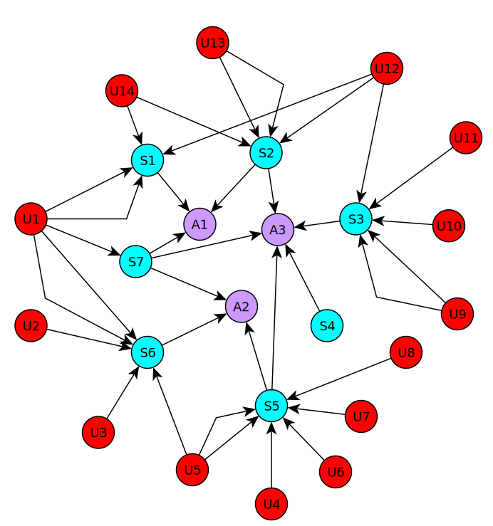

Graph-based Recommender
=======================

Graph-based recommender for BBC positive only feedback dataset using Gremlin graph query language.

How-To-Run
----------
1. Download Titan Graph Database v0.4.4 (all): http://thinkaurelius.github.io/titan/
2. Set the Java VM args for groovy/gremlin. The complete BBC 6.7 Mio ratings dataset needs at least 35Gb (!) of RAM. If you want to serialize the graph to disk you also need to increase the stack size. Hence:
    
    ```bash
    JAVA_OPTIONS="-Xms1g -Xmx35g -Xss100m"
    export JAVA_OPTIONS
    ```
3. Pass `main.groovy` to `gremlin.sh` in script mode (`-e`):
    
    ```bash
    titan-all-0.4.4/bin/gremlin.sh -e path/to/Graph-based-recommender/main.groovy -p dir/for/optional/graph/serialization -u some,user,ids,to,process path/to/BBC/dataset path/to/output/directory
    ```

Graph Structure
-----
Graphs queried for recommendations have the structure depicted below.
* Vertices in red: User
* Vertices in cyan: Shows
* Vertices in purple: Show Attributes (e.g. 'genres/comedy' or 'service/bbcfour')
* User -> Show edge: 'watched'
* Show -> Attribute edge: 'show has attribute'

If a user watches the same show more than once the graph contains multiple 'watched' edges between the user and the show.




Recommendation Strategies
-----
The recommendations are determined by the implementation of `IRecommendationStrategy`:
````groovy
interface IRecommendationStrategy{
	List<Vertex> recommendShowsToUser(Vertex user);
}
````

* `RankedCollaborativeFilteringRecommendationStrategy`: Pure collaborative filtering. Recommended are shows that have not been watched by the current user but by users that watched at least one of the shows that the current user watched. The retrieved shows are ranked by the number of shortest paths (length == 3) from the current user to the new shows.

    ```groovy
    class RankedCollaborativeFilteringRecommendationStrategy implements IRecommendationStrategy{
        List recommendShowsToUser(Vertex user){
            // find all path from current user to new shows in one other user distance, count number of paths to new show, order descending by counts 
            def showsWatchedByCurrentUser = [];
            // gremlin code follows
            return user.out('watched').aggregate(showsWatchedByCurrentUser).in('watched').out('watched').except(showsWatchedByCurrentUser).groupCount.cap.orderMap(T.decr).toList();
        }
    }
    ```


